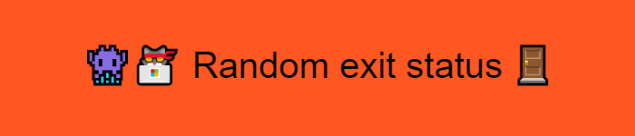
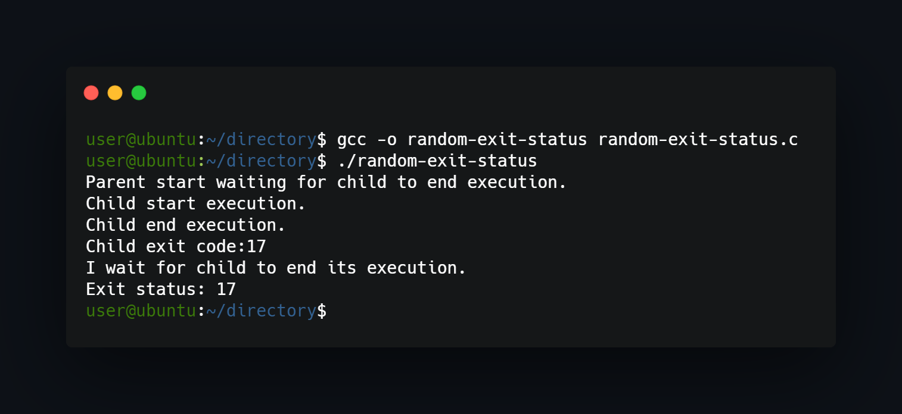

## What project do?
___
Simple program forks itself into parent-child configuration, then parent waits for child to end its execution and exit status is choosen randomly.



## How to use?
___
Just compile and run:
```
gcc -o random-exit-status random-exit-status.c 
./random-exit-status 
```


<!--https://banner.godori.dev/ height:150-->
<!--https://shields.io/-->
<!--https://carbon.now.sh/-->